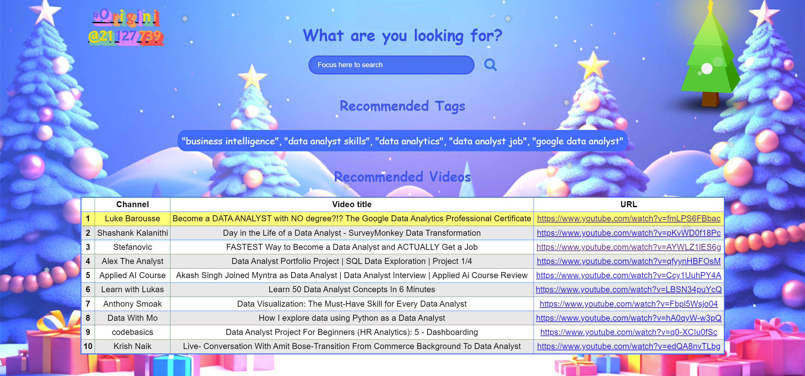

# FinalProject_Introduction-to-data-science

## Group Information

Group id: `02`

| Name               | Student ID | Email                       |
| ------------------ | ---------- | --------------------------- |
| Võ Duy Anh         | 21127221   | vdanh21@clc.fitus.edu.vn    |
| Nguyễn Mậu Gia Bảo | 21127583   | nmgbao21@clc.fitus.edu.vn   |
| Lê Mỹ Khánh Quỳnh  | 21127681   | lmkquynh21@clc.fitus.edu.vn |
| Vũ Minh Phát       | 21127739   | vmphat21@clc.fitus.edu.vn   |

## Project Plan via Trello
- [Trello](https://trello.com/invite/b/N5UME2gN/ATTI9c62b7b4bebce4b5b632ca02c1511b0eE139B74C/final-project-intro2ds)
## How to run Flask web application?

- Demo:
  

- Step 1: Move your programming environment to root folder.
- Step 2: Run Flask application by executing the command in your terminal:

```bash
python .\src\app.py
```

- Step 3: Visit **`http://127.0.0.1:5000/`** in your web browser to interact with web application.
